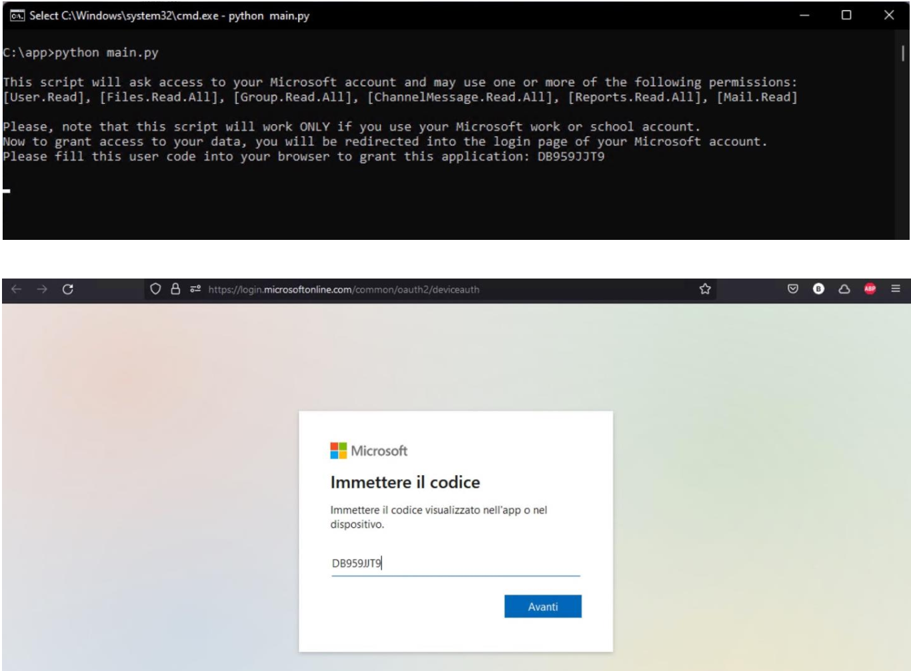
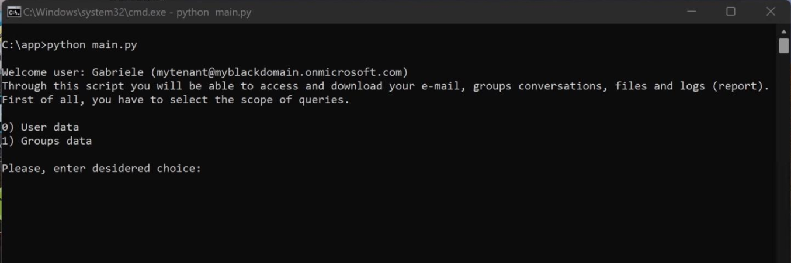

# Microsoft 365 (SharePoint/Azure) scraper
   

Access your personal data on Microsoft 365 (SharePoint) and Azure through Microsoft Graph official API.

* **CLI only**
* Read latest 50 e-mail of a single user
* Read chat of Microsoft Teams of a single user (Channel messages)
* List and download files on Microsoft OneDrive (Business) of a single user
* List and download logs of a single user [7/30/90/180 days]
* Read chat of Microsoft Teams of a group (Channel messages)
* List and download files of the group which belong to your tenant on Microsoft SharePoint
* List and download logs of the group which belong to your tenant [7/30/90/180 days]

## Getting Started

* You **MUST** be the administrator of your tenant to use this.
* First of all, register a new application in your Azure Active Directory control panel in order to obtain your personal and unique ID (later you will copy this ID both on MSAL authentication script (folder get_token) and in each script you need to use) [link](https://learn.microsoft.com/en-us/azure/active-directory/develop/quickstart-register-app).
* Set correct permissions based on your needings. On Azure AD set **Delegated permission** then **Add permission**.
* To ensure the best results possible, grant every permissions of this list [(documentation)](https://learn.microsoft.com/en-us/azure/active-directory/develop/quickstart-configure-app-access-web-apis):
    * User.Read
    * Files.Read.All
    * Group.Read.All
    * ChannelMessage.Read.All
    * Reports.Read.All
    * Mail.Read

## Dependencies

* Python 2+
* Microsoft Authentication Library for Python [MSAL](https://github.com/AzureAD/microsoft-authentication-library-for-python)

## Installation
* Download latest version.
* You need to fill your unique application ID into each script you need to use in the root folder. For instance, if you just want to download some of your file from OneDrive, you will have to edit the file "ms_files" and on the top of it, fill it your application ID.

## Documentation
* Full documentation is provided only on Italian (manual folder).

## Examples

On the first launch, execute the script main:

This will call the MSAL authentication to login on Microsoft server. Then after a successful login you can choose the scope which you prefer (Single user or group):

## License

This project is licensed under the MIT License - see the LICENSE file for futher details.

_For any questions or doubts, feel free to contact me at gabriele.patta@outlook.com_